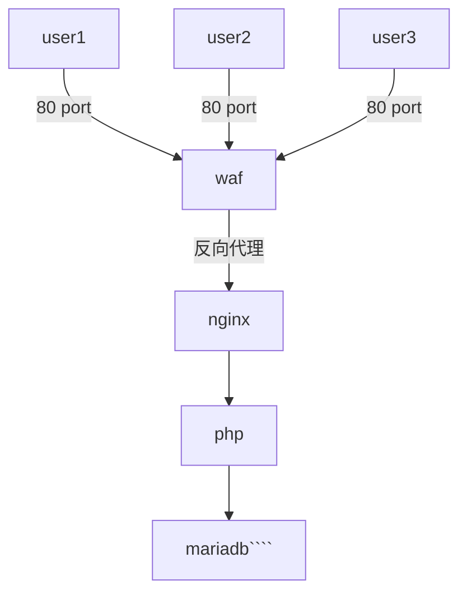

## ModSecurity WAF (Web Application Firewall)

ModSecurity 是一個 open source web application firewall，\
可以用來檢測和阻擋對 Web Server 的攻擊。

ModSecurity 定義了 OWASP ModSecurity Core Rule Set (CRS) \
來檢查每個 request 是否違反了規則。

本架構參考網址:\
1. https://www.claytontan.net/2019/12/16/nginx-基本功能-dynamic-module/ \
   講解如何在nginx中新增編譯動態模組 (dynamic module)。
2. https://www.claytontan.net/2020/01/09/nginx-安全性-security-二/ \
   講解 owasp-modsecurity-crs 檢測規則如何導入。
3. https://blog.csdn.net/zhaosongbin/article/details/103808357 \
   在導入規則後，會有地區規則無法使用的問題，此文提供解法。

根據第1個連結，以nginx為基底建置了`Dockerfile`。由於 `modsecurity.conf` 需要控制啟用阻擋， 所以搬出以 `docker-compose.yml` 對資料容器進行綁定。

根據第2、3個連結，因為在之後需要更新與調整最新的 OWASP 規則，因此撰寫了一個規則安裝腳本`owasp-install.sh`，以便後續建立起容器後可以規則進行動態調整。

## 系統架構


## 系統建置
waf image建置時間較長，可以事先依照 waf/Dockerfile 建置名為waf的image
```shell
root@certificationmark:# cd /var/www/html/CertificationMark/docker/markq/waf
root@certificationmark:# docker build -t waf . --no-cache
```

建立完成後可回到上一層利用`docker-compose.yml`建置容器。
若有已建置舊有架構(無waf)，可先把服務down下來再進行重建。(mariadb 資料有將容器綁定出來的話資料就不會消失)
```shell
root@certificationmark:# cd /var/www/html/CertificationMark/docker/markq/
root@certificationmark:# docker-compose down && docker-compose up -d
```

## 安裝OWASP規則
執行安裝指令:
```shell
root@certificationmark:# docker exec markq_waf bash owasp-install.sh
```

**!!!注意!!!** \
**`owasp-install.sh`腳本必須為Linux的分行符號`\n`** \
**若為Windows的分行符號`\r\n`會導致安裝錯誤，請特別注意**

若安裝好後會依照最新的OWASP規則過濾網頁行為 \
範例: http://127.0.0.1/.env
* 安裝前 回應 200 但無內容。
* 安裝後 回應 403 Forbidden。