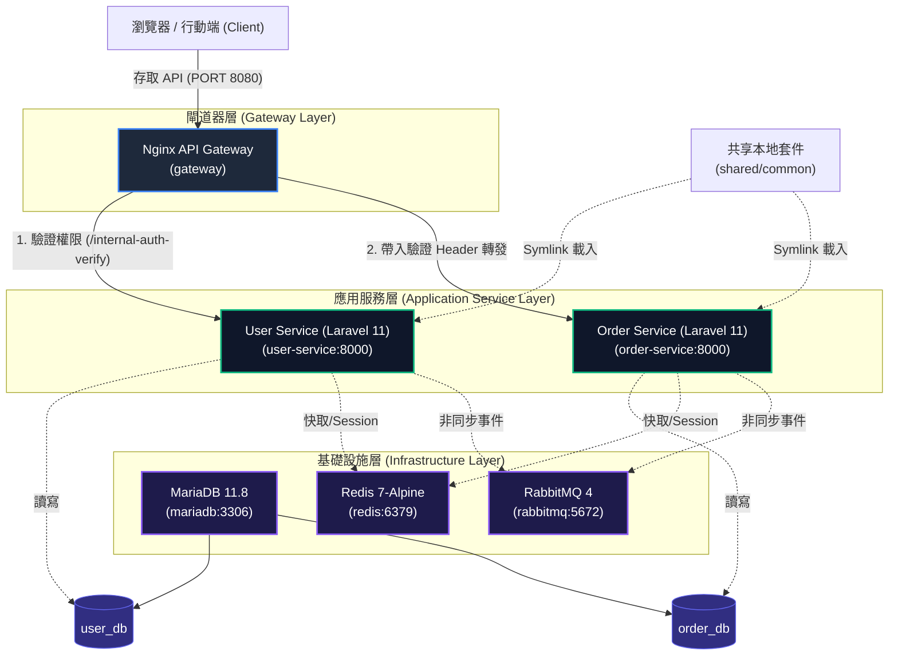

# 羽球微服務平台 (U-Badminton) - Docker 容器化與網路架構設計說明
* 更新時間(26/7/14)

本專案採用**微服務自治性 (Microservice Autonomy)** 與 **Database-per-Service** 架構設計，並透過 Docker 進行完整的容器化管理與本地開發環境模擬。本文件將詳細介紹整體容器化架構、網路拓撲、認證機制以及開發維運指引。

---

## 一、 系統架構設計藍圖

本系統由 **API Gateway** 統一作為對外入口，並透過 Docker Bridge 虛擬網路進行內部服務通訊與協調。以下是整體的架構拓撲與流量流向圖：



---

## 二、 專案目錄結構與 Docker 元件關聯

以下是本專案的目錄結構，特別標記了與 Docker 配置及容器建置相關的檔案：

```text
DDDTest/ (專案根目錄)
├── gateway/                        # API Gateway 服務目錄
│   ├── Dockerfile                  # API Gateway 的建置檔 (基於 nginx:alpine)
│   └── default.conf                # Nginx 反向代理、權限校驗與路由設定
│
├── infrastructure/                 # 共享基礎設施設定
│   ├── mariadb/                    # MariaDB 資料庫設定
│   │   ├── Dockerfile              # MariaDB 建置檔 (基於 mariadb:11.8)
│   │   ├── my.cnf                  # 資料庫伺服器配置檔
│   │   └── init-db.sql             # 自動初始化多資料庫與帳限腳本
│   └── redis/                      # Redis 快取服務設定 (預留)
│
├── services/                       # 微服務主目錄
│   ├── user-service/               # 使用者服務 (PHP Laravel 11)
│   │   ├── Dockerfile              # 獨立 PHP-FPM 建置檔 (支援 Composer Path)
│   │   └── ...                     # 業務邏輯與 Laravel 配置
│   │
│   └── order-service/              # 訂單服務 (PHP Laravel 11)
│       ├── Dockerfile              # 獨立 PHP-FPM 建置檔
│       └── ...                     # 業務邏輯與 Laravel 配置
│
├── shared/                         # 共享通用程式碼
│   └── common/                     # 本地共享 PHP 套件 (ddd-test/common)
│
├── docker-compose.yml              # 應用服務層 (Services & Gateway) 啟動配置
├── docker-compose.infra.yml        # 基礎設施層 (MariaDB, Redis, RabbitMQ) 啟動配置
└── README.md                       # 專案啟動與操作手冊
```

---

## 三、 各服務容器詳細配置與角色

### 1. API Gateway (`gateway`)
* **容器映像檔**: 基於 `nginx:1.26-alpine`。
* **設定檔**: [gateway/default.conf](file:///C:/Users/LIN/Desktop/DLH/project/DDDTest/gateway/default.conf)。
* **主要職責**:
  * 對外曝露埠口 `8080`，作為唯一的入口 API 進入點。
  * **統一路由分流**: 將 `/api/auth`、`/api/users` 等請求轉發至 `user-service`，將 `/api/orders` 轉發至 `order-service`。
  * **閘道器層權限攔截 (auth_request)**:
    當請求存取受保護路由 (如 `/api/orders`) 時，Nginx 會先發送子請求 (Subrequest) 至 `/internal-auth-verify` (即 `user-service` 的驗證端點)。
    * 驗證失敗: Nginx 拦截並直接回傳統一的 JSON 格式錯誤訊息（不曝露內部核心邏輯）。
    * 驗證成功: `user-service` 回傳包含用戶識別與角色的響應頭，Nginx 再藉由 `auth_request_set` 取得這些資訊並轉化為 `X-User-Id`、`X-User-Roles` 與 `X-User-Venues` 等 Header 注入，安全地轉發給下游服務。

### 2. 用戶與權限服務 (`user-service`)
* **容器映像檔**: 參考 [services/user-service/Dockerfile](file:///C:/Users/LIN/Desktop/DLH/project/DDDTest/services/user-service/Dockerfile)，基於 `php:8.4-fpm`，安裝了 `pdo_mysql` 等核心擴充套件，並內建 Composer 環境。
* **通訊埠口**: 容器內部監聽 `8000` 埠。
* **主要職責**:
  * 處理用戶登入、註冊、角色權限分派。
  * 提供 `/api/auth/verify` 供 Gateway 進行無狀態 Token 驗證。
  * 管理及寫入 `user_db`。

### 3. 訂單服務 (`order-service`)
* **容器映像檔**: 參考 [services/order-service/Dockerfile](file:///C:/Users/LIN/Desktop/DLH/project/DDDTest/services/order-service/Dockerfile)，配置與 `user-service` 一致。
* **通訊埠口**: 內部監聽 `8000` 埠。
* **主要職責**:
  * 處理球館訂單、課程預約與款項紀錄。
  * 藉由讀取 Gateway 注入的 `X-User-Id` 等資訊獲取當前操作者身分，實現完全解耦的業務邏輯。
  * 管理及寫入 `order_db`。

### 4. 基礎設施 (`mariadb`, `redis`, `rabbitmq`)
* **MariaDB**: 使用 `mariadb:11.8`，掛載 [infrastructure/mariadb/my.cnf](file:///C:/Users/LIN/Desktop/DLH/project/DDDTest/infrastructure/mariadb/my.cnf) 優化資料庫配置，並在容器初始化時自動執行 [infrastructure/mariadb/init-db.sql](file:///C:/Users/LIN/Desktop/DLH/project/DDDTest/infrastructure/mariadb/init-db.sql) 以建立 `user_db` 與 `order_db`。
* **Redis**: 快取與 Session 共享儲存庫。
* **RabbitMQ**: 作為異步事件的 Message Broker（預留用於微服務間的事件驅動設計，如訂單完成後通知用戶服務或寄送通知）。

---

## 四、 核心設計機制與考量

### 1. 微服務獨立生命週期 (Microservice Autonomy)
每個微服務均擁有其獨立的 `Dockerfile`，這意味著：
* 每個服務可以使用不同的 PHP 版本或需要特定的 OS/PHP 擴充套件 (如 GD 庫、Redis 擴充等) 而不互相干擾。
* 在 CI/CD 流程中，Git 偵測到某個服務目錄 (如 `services/order-service/`) 異動時，僅需重新 Build 該服務的 Image 並重啟對應容器，實現**增量建置與無感更新**。

### 2. 共享本地套件 (Composer Path Repository) 建置設計
由於本專案在 `shared/common` 開發了共用的 PHP 套件（例如統一的 `ApiResponder`），我們在 `composer.json` 中配置了路徑倉庫：
```json
"repositories": [
    {
        "type": "path",
        "url": "../../shared/common",
        "options": {
            "symlink": true
        }
    }
]
```
為了在 **本地開發** 與 **生產環境建置** 均能完美相容，我們採取了以下設計：
* **本地開發 (docker-compose)**:
  在 [docker-compose.yml](file:///C:/Users/LIN/Desktop/DLH/project/DDDTest/docker-compose.yml) 中掛載 `./shared:/shared` 與 `./services/user-service:/app`。這使得容器內部的 `/shared` 能對應到 Host 的實際共享目錄，Composer 建立的 Symlink (指向 `../shared/common`) 在容器內便能被正確解析。
* **生產環境建置 (Dockerfile)**:
  在 [Dockerfile](file:///C:/Users/LIN/Desktop/DLH/project/DDDTest/services/user-service/Dockerfile) 中，我們在執行 `composer install` 之前先將本機的 `shared/` 目錄複製到 Image 根目錄的 `/shared/`：
  ```dockerfile
  COPY shared/ /shared/
  WORKDIR /app
  COPY services/user-service/ .
  RUN composer install --no-interaction --optimize-autoloader --no-scripts
  ```
  這保證了在沒有本地掛載 (Volume) 的 Production environment 中，Docker 映像檔依然能獨立建置成功，且路徑結構完全一致。

### 3. 多 Compose 檔案分離策略
* [docker-compose.infra.yml](file:///C:/Users/LIN/Desktop/DLH/project/DDDTest/docker-compose.infra.yml) 用於啟動基礎設施，生命週期較長，通常只需啟動一次。
* [docker-compose.yml](file:///C:/Users/LIN/Desktop/DLH/project/DDDTest/docker-compose.yml) 用於啟動頻繁更新的業務微服務與 Gateway。
兩者透過一個外部共享的 Bridge 網路 `dddtest-network` 串聯，確保了服務的可維護性。

---

## 五、 開發與部署快速指引

### 1. 一鍵啟動開發環境
在專案根目錄下，依序執行：
```bash
# 1. 建立並啟動基礎設施 (會自動建立 dddtest-network)
docker compose -f docker-compose.infra.yml up -d

# 2. 啟動微服務與 API 閘道器
docker compose up -d
```

### 2. 執行資料庫遷移
當容器啟動完成後，需要對各服務的資料庫進行 Schema 初始化：
```bash
# 初始化使用者資料庫與種子資料
docker exec dddtest-user-service-1 php artisan migrate --seed

# 初始化訂單資料庫
docker exec dddtest-order-service-1 php artisan migrate
```

---

## 六、 常見問題與運作維護 (Troubleshooting)

### 1. 宿主機與容器的 Symlink 解析失敗
* **現象**: 容器內噴錯表示找不到 `ddd-test/common` 中的類別。
* **原因**: 未正確掛載 `shared` 卷。
* **解決辦法**: 確保 [docker-compose.yml](file:///C:/Users/LIN/Desktop/DLH/project/DDDTest/docker-compose.yml) 中對應服務的 `volumes` 區塊包含 `- ./shared:/shared`。

### 2. 基礎設施容器離線導致服務連線失敗
* **現象**: `user-service` 報告 `SQLSTATE[HY000] [2002] Connection refused`。
* **原因**: `mariadb` 容器重啟或與 `dddtest-network` 斷開。
* **解決辦法**: 檢查 `docker ps`，若基礎設施正常，可執行以下指令重新連結網路：
  ```bash
  docker network disconnect dddtest-network dddtest-mariadb-1
  docker network connect --alias mariadb dddtest-network dddtest-mariadb-1
  ```

---

## 七、 新增微服務的標準設定流程

若專案需要擴充新的微服務（以 `payment-service` 為例），請遵循以下標準化步驟進行設定：

### 1. 建立服務目錄與 Dockerfile
在 `services/` 底下新增服務資料夾，並新增 [Dockerfile](file:///C:/Users/LIN/Desktop/DLH/project/DDDTest/services/user-service/Dockerfile)（可直接複製現有服務的 Dockerfile 作為範本），請務必修改**複製服務檔案**的路徑：
```dockerfile
# ... 前置安裝與 Composer 複製維持不變 ...

# 複製共享本地套件
COPY shared/ /shared/

WORKDIR /app

# 複製服務本身的檔案 (修改為新服務的相對路徑)
COPY services/payment-service/ .

# ... 後續安裝與啟動命令維持不變 ...
```

### 2. 配置 Composer 本地路徑倉庫（Path Repository）
若新服務需要存取共用函式庫（例如 `ApiResponder` 或語系翻譯），在 `services/payment-service/composer.json` 中配置：
```json
{
    "repositories": [
        {
            "type": "path",
            "url": "../../shared/common",
            "options": {
                "symlink": true
            }
        }
    ],
    "require": {
        "ddd-test/common": "*"
    }
}
```

### 3. 設定專屬資料庫 (Database-per-Service)
為了保持服務自治，需為新服務配置獨立的資料庫：
1. 編輯 [infrastructure/mariadb/init-db.sql](file:///C:/Users/LIN/Desktop/DLH/project/DDDTest/infrastructure/mariadb/init-db.sql)，加入資料庫建立與使用者權限設定：
   ```sql
   CREATE DATABASE IF NOT EXISTS payment_db CHARACTER SET utf8mb4 COLLATE utf8mb4_unicode_ci;
   GRANT ALL PRIVILEGES ON payment_db.* TO 'ai4dt123'@'%';
   ```
2. 若資料庫已在運行中，可直接連入 MariaDB 容器執行上述 SQL 命令，或重新建置 MariaDB：
   ```bash
   docker compose -f docker-compose.infra.yml up -d --build mariadb
   ```

### 4. 註冊至 `docker-compose.yml`
在根目錄的 [docker-compose.yml](file:///C:/Users/LIN/Desktop/DLH/project/DDDTest/docker-compose.yml) 中加入新服務的容器宣告：
```yaml
  payment-service:
    build:
      context: .
      dockerfile: services/payment-service/Dockerfile
    volumes:
      - ./services/payment-service:/app
      - ./shared:/shared
      - payment-vendor:/app/vendor
    environment:
      APP_ENV: local
      APP_DEBUG: "true"
      DB_CONNECTION: mysql
      DB_HOST: mariadb
      DB_PORT: 3306
      DB_DATABASE: payment_db
      DB_USERNAME: root
      DB_PASSWORD: root@0000
      # 若需要存取其他服務，在此配置環境變數，例如：
      USER_SERVICE_URL: http://user-service:8000
    restart: unless-stopped
    networks:
      - dddtest-network
```
同時，記得在 `docker-compose.yml` 的最底端 `volumes` 區塊中定義具名 Volume，以阻隔本地 `vendor` 快取：
```yaml
volumes:
  user-vendor:
  order-vendor:
  payment-vendor: # 新增此行
```

### 5. 在 API Gateway 配置路由與權限校驗
編輯 [gateway/default.conf](file:///C:/Users/LIN/Desktop/DLH/project/DDDTest/gateway/default.conf)，在 `server` 區塊中加入新服務路由（可選擇是否啟動 Gateway 權限校驗）：
```nginx
    # 新增支付服務路由 (使用 Gateway 權限攔截)
    location /api/payments {
        auth_request /internal-auth-verify;
        error_page 401 = @error401;

        # 擷取驗證成功回傳的 Header 並向下游服務傳遞
        auth_request_set $auth_user_id $upstream_http_x_user_id;
        auth_request_set $auth_user_roles $upstream_http_x_user_roles;
        auth_request_set $auth_user_venues $upstream_http_x_user_venues;

        proxy_set_header X-User-Id $auth_user_id;
        proxy_set_header X-User-Roles $auth_user_roles;
        proxy_set_header X-User-Venues $auth_user_venues;

        proxy_pass http://payment-service:8000;
        proxy_set_header Host $host;
        proxy_set_header Accept "application/json";
        proxy_set_header X-Real-IP $remote_addr;
        proxy_set_header X-Forwarded-For $proxy_add_x_forwarded_for;
        proxy_set_header X-Forwarded-Proto $scheme;
    }
```
配置完成後，重啟 Gateway 使設定生效：
```bash
docker compose up -d --build gateway
```

### 6. 一鍵啟動與初始化新服務
```bash
# 啟動新服務容器
docker compose up -d --build payment-service

# 執行新服務的資料庫 Migration (若有)
docker exec payment-service php artisan migrate
```

---

## 八、 移除微服務的標準清理流程

當需要下線或移除某個微服務時（以 `payment-service` 為例），請遵循以下步驟進行完整清理，以避免殘留無效的容器、網路路由與實體磁碟卷：

### 1. 停止並刪除運行中的服務容器與磁碟卷
為了釋放系統資源，請先停止該容器並刪除與其綁定的 Named Volume：
```bash
docker compose rm -f -s -v payment-service
```
*參數說明：`-f` 強制刪除，`-s` 停止容器，`-v` 移除關聯的具名磁碟卷（如 `payment-vendor`）。*

### 2. 移除 `docker-compose.yml` 中的服務定義
編輯 [docker-compose.yml](file:///C:/Users/LIN/Desktop/DLH/project/DDDTest/docker-compose.yml)：
1. 刪除 `services` 區塊下的 `payment-service:` 所有定義。
2. 刪除最底端 `volumes` 區塊下的 `payment-vendor:`。

### 3. 清理 API Gateway 路由
編輯 [gateway/default.conf](file:///C:/Users/LIN/Desktop/DLH/project/DDDTest/gateway/default.conf)：
1. 刪除與該服務相關的 `location /api/payments` 區塊。
2. 重新編譯並啟動 Gateway 以套用新路由設定：
   ```bash
   docker compose up -d --build gateway
   ```

### 4. 移除資料庫設定與資料庫本身
1. 編輯 [infrastructure/mariadb/init-db.sql](file:///C:/Users/LIN/Desktop/DLH/project/DDDTest/infrastructure/mariadb/init-db.sql)，刪除與該服務資料庫相關的 SQL 語法：
   ```sql
   -- 移除這兩行
   CREATE DATABASE IF NOT EXISTS payment_db ...
   GRANT ALL PRIVILEGES ON payment_db.* ...
   ```
2. （選用）若要徹底刪除現有資料，可連入 MariaDB 容器手動刪除資料庫：
   ```sql
   DROP DATABASE IF EXISTS payment_db;
   ```

### 5. 刪除實體專案目錄
確認程式碼已完成備份或 Commit 後，直接刪除實體檔案夾：
* Windows (PowerShell):
  ```powershell
  Remove-Item -Recururse -Force ./services/payment-service
  ```
* Linux / macOS:
  ```bash
  rm -rf ./services/payment-service
  ```


